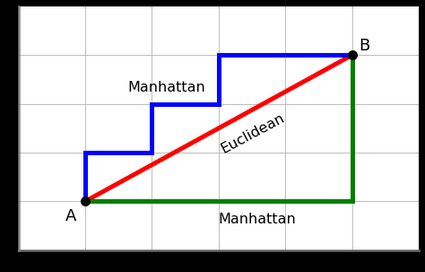
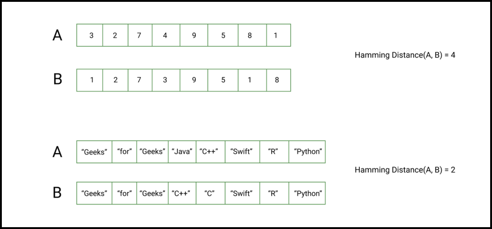

# **Measuring Distance Between Data Points**

---

## **1. Manhattan & Euclidean Distances**

### **Manhattan Distance**
- **Definition**: Sum of absolute differences across each dimension (a.k.a. “Taxicab” distance).
- **Formula** (2D example):  
  $$
  d_{\text{Manhattan}}(A,B) = |x_1 - x_2| + |y_1 - y_2|
  $$
- **Example**:  
  A = (2, 4), B = (5, 8)  
  $$
  d = |2-5| + |4-8| = 3 + 4 = 7
  $$
- **Usage**: Good for grid-like data or when large coordinate differences (outliers) may skew Euclidean results.

### **Euclidean Distance**
- **Definition**: Straight-line distance between points in Euclidean space.
- **Formula** (2D example):  
  $$
  d_{\text{Euclidean}}(A,B) = \sqrt{(x_1 - x_2)^2 + (y_1 - y_2)^2}
  $$
- **Example**:  
  A = (2, 4), B = (5, 8)  
  $$
  d = \sqrt{(2-5)^2 + (4-8)^2} = \sqrt{9 + 16} = \sqrt{25} = 5
  $$
- **Usage**: Common in clustering (e.g., K-means) or nearest-neighbor searches.

---

## **2. Hamming Distance**

- **Definition**:  
  Measures the number of positions at which two sequences (e.g., strings or binary sequences) differ.

- **Formula** (for two strings of equal length \( n \)):  
  $$
  d_{\text{Hamming}}(S_1,S_2) = \sum_{i=1}^n \mathbf{1}(S_1[i] \neq S_2[i])
  $$
  - Here, the indicator function equals:
    - **1** if the character at position \( i \) in \( S_1 \) is different from that in \( S_2 \),
    - **0** if they are the same.
    
    and is calculated by:
$$
\mathbf{1}(S_1[i] \neq S_2[i])
$$
    
- **How it works**:
  - The equation iterates through each position \( i \) (from 1 to \( n \)) of the sequences.
  - At each position, it checks if the symbols differ:
    - If yes, it adds 1 to the total count.
    - If no, it adds 0.
  - The final sum gives the total number of mismatches between the two sequences.

- **Example**:
    Compare “cat” vs. “car”:
    - Position 1: 'c' vs. 'c' → same (0)
    - Position 2: 'a' vs. 'a' → same (0)
    - Position 3: 't' vs. 'r' → different (1)  
    Total Hamming distance = \( 0+0+1 = 1 \)

- **Usage**:  
  Commonly used in error-correcting codes, DNA sequence analysis, or any scenario where comparing discrete symbols is needed.

---

## **Why Different Measures?**
- **Manhattan**: Better for grid-like data and more robust to outliers in high-dimensional spaces.  
- **Euclidean**: Natural for continuous numeric data; measures the direct “straight-line” distance.  
- **Hamming**: Ideal for categorical or discrete data comparisons (e.g., strings, bits).

Each metric aligns with different data characteristics and problem requirements. Selecting the right distance measure ensures more accurate modeling, better clustering, or more relevant similarity assessments.
