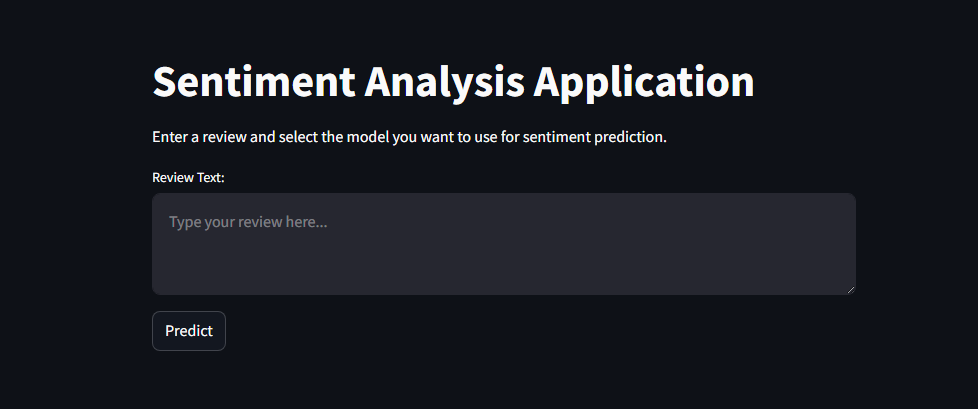
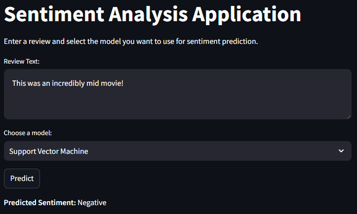
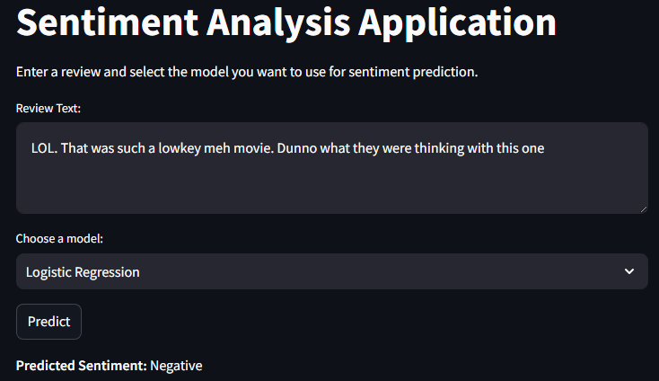
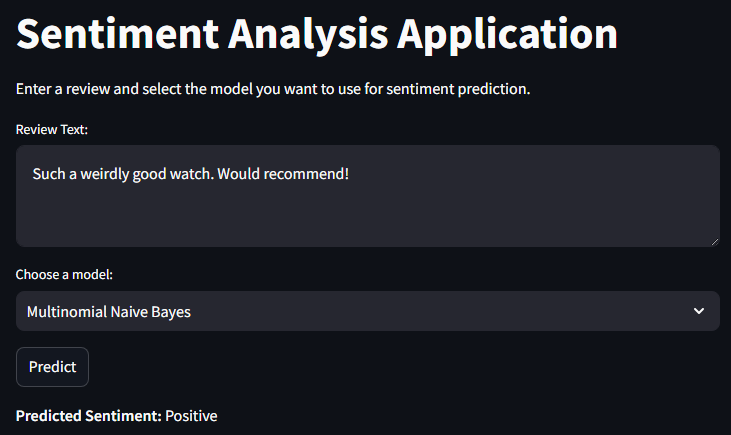

# Streamlit documentation
### From notebook to streamlit


## The models
We start by first initializing our stored models which were finetuned and thus are our currently best fitted 'products' for use.

```python
vectorizer_path = Path("./models/vectorizer.pkl")
model_paths = {
    "Support Vector Machine": Path("./models/LinearSVC.pkl"),
    "Logistic Regression": Path("./models/LogisticRegression.pkl"),
    "Multinomial Naive Bayes": Path("./models/MultinomialNB.pkl")
}
```

After doing so we locally "open" these files using python and essentially have them loaded and ready to be used on the streamlit.

Needless to say, these models are our best, meaning we dont need to go through rigirous AI-training to use them on streamlit. The benefit of training a model is that we can store them for later use, and that is what will be used for our streamlit until a future improved model would take its place.

## Designing the streamlit

The design of our streamlit would essentially be the design of our product, meaning it needs to be clear and userfriendly. We started off with a simple textbox and using a hardcoded model to ensure that our interface was working.



upon having a working interface, all that was left to do was add the model keys one by one as we test each integration; this part is easy as we already had all the model-paths loaded and opened.

Finally we have our app finished. Our product lets you write a text input, which our model will determine to be either positive or negative. Here are some examples of these models taking some not-so-straight-forward inputs:
### Support Vector Machine


### Logistic Regression


### Multinomial Naive Bayes


# Conclusion

We now have 3 models that we have trained, iterated over and validated. These were our currently highest scoring models and will thus be displayed on our streamlit application as a product for use. As can be seen by this documentation, our model can take various different inputs, some more ambiguous than others and still score relatively high on their accuracy.